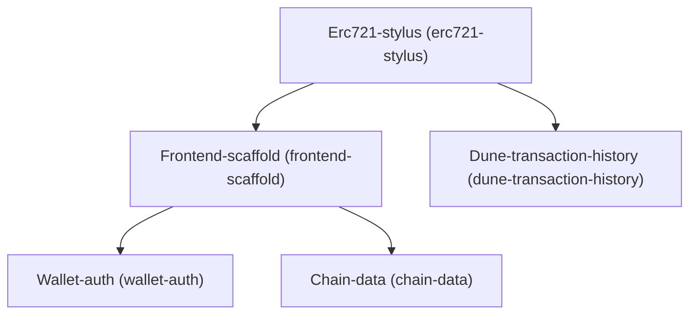

# Architecture

## Dependency Graph

## Execution / Implementation Order

1. **Erc721-stylus** (`016e1463`)
2. **Frontend-scaffold** (`99ebf0cf`)
3. **Dune-transaction-history** (`d6152b57`)
4. **Wallet-auth** (`6824e04f`)
5. **Chain-data** (`f3f2cb18`)
